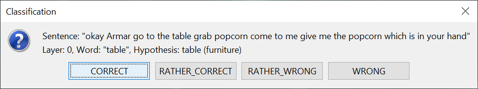

# Environment for Analysis of AGents based on Led Exploration (EAGLE Evaluator Tool)
This tool is part of [EAGLE](https://github.com/kit-sdq/eagle).
In order to evaluate an exploration of EAGLE, this tool has been realized.
This evaluator provides an graphical (or textual) interface to perform a manual classification of all found hypotheses.
After classification, you can use the classification to evaluate the actual exploration in terms of precision, recall, f1 score, and/or other classification metrics.

